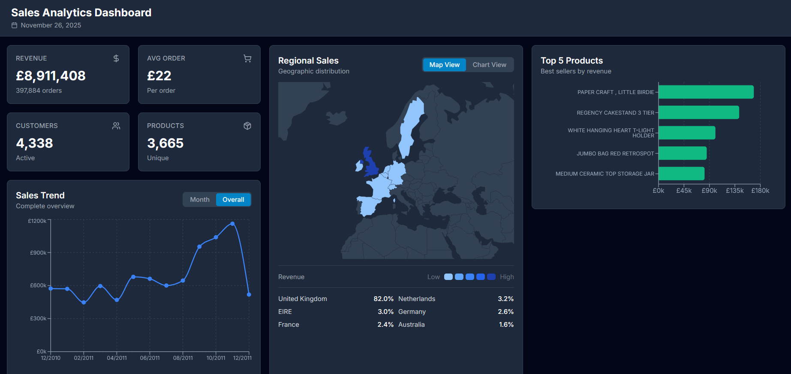

# Sales Analytics Dashboard

Full-stack sales analytics application with interactive data visualization, built with .NET Web API and React.



## Project Overview

A sales analytics dashboard that processes and visualizes over 400,000 e-commerce transactions from a UK online retailer.

**Built by:** Filip Kucharko  
**Year:** 2025/2026

## Features

### Data Visualization

- **Sales Trend Analysis** - Monthly revenue tracking with interactive timeline
- **Geographic Distribution** - Interactive world map showing sales by country
- **Product Performance** - Top 5 best-selling products by revenue
- **Regional Breakdown** - Pie chart with top 5 countries + others
- **Key Performance Indicators** - Real-time metrics cards

### Technical Features

- **RESTful API** - 14 endpoints for data access
- **Type Safety** - TypeScript throughout frontend
- **Real-time Data** - Live fetching from backend
- **Error Handling** - Graceful loading and error states
- **CORS Configured** - Secure cross-origin requests

## Tech Stack

### Backend

- **.NET 8.0** - Web API framework
- **Entity Framework Core** - ORM for database access
- **SQL Server** - Database management
- **Swagger** - API documentation
- **C#** - Primary language

### Frontend

- **React 18** - UI library
- **TypeScript** - Type safety
- **Vite** - Build tool
- **Tailwind CSS** - Styling framework
- **Recharts** - Data visualization
- **react-simple-maps** - Geographic maps
- **Axios** - HTTP client

### Database

- **SQL Server** - Relational database
- **397,884 transactions** - Real e-commerce data
- **4,338 customers** - Unique customer records
- **3,665 products** - Product catalog

## Project Structure

```
sales-analytics-dashboard/
├── backend/                    # .NET Web API
│   └── SalesAnalytics.API/
│       ├── Controllers/        # 4 API controllers
│       ├── Models/             # Entity classes
│       ├── Data/               # DbContext
│       ├── DTOs/               # Data transfer objects
│       ├── Services/           # Business logic
│       └── README.md
│
├── frontend/                   # React Application
│   └── src/
│       ├── components/         # React components
│       ├── services/           # API integration
│       ├── types/              # TypeScript types
│       ├── hooks/              # Custom hooks
│       └── README.md
│
├── database/                   # ETL & SQL scripts
│   ├── etl_pipeline.ipynb     # Data processing
│   └── create_database.sql    # Database schema
│
└── README.md                   # This file
```

## Getting Started

### Prerequisites

- .NET 8 SDK
- SQL Server
- Node.js 18+
- npm or yarn

### 1. Database Setup

```bash
# Import the Kaggle dataset (UK E-Commerce Data)
# Run the ETL pipeline in database/etl_pipeline.ipynb
# This creates and populates the SalesAnalyticsDB database
```

### 2. Backend Setup

```bash
cd backend/SalesAnalytics.API

# Restore dependencies
dotnet restore

# Update connection string in appsettings.json
# Then run the API
dotnet run
```

### 3. Frontend Setup

```bash
cd frontend

# Install dependencies
npm install

# Start development server
npm run dev
```

## Testing

### Backend

```bash
# Swagger UI for API testing
http://localhost:5192/swagger

# Or use Postman collection
backend/SalesAnalytics.postman_collection.json
```

### Frontend

- Manual testing in browser
- Check console for errors
- Test all interactive features
